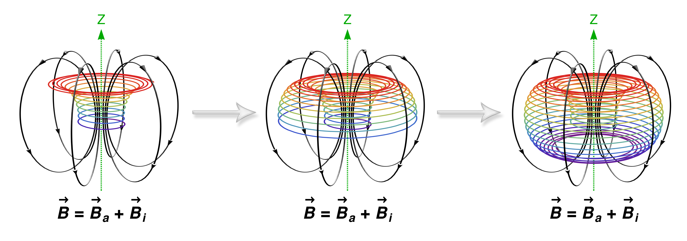

---
##### Abstract

In this letter, we provide a detailed numerical examination of the dynamics of a charged Thomas oscillator in an external magnetic field. We do so by adopting and then modifying the cyclically symmetric Thomas oscillator to study the dynamics of a charged particle in an external magnetic field. These dynamical behaviours for weak and strong field strength parameters fall under two categories; conservative and dissipative. The system shows a complex quasi-periodic attractor whose topology depends on initial conditions for high field strengths in the conservative regime. There is a transition from adiabatic motion to chaos on decreasing the field strength parameter. In the dissipative regime, the system is chaotic for weak field strength and weak damping but shows a limit cycle for high field strengths. Such behaviour is due to an additional negative feedback loop that comes into action at high field strengths and forces the system dynamics to be stable in periodic oscillations. For weak damping and weak field strength, the system dynamics mimic Brownian motion via chaotic walks. We claim that the modified Thomas oscillator is a prototypical model to understand the dynamics of an active particle.

---

##### Figure 1: Artistic representation of the attractor with magnetic field lines.



---

##### Download

+ [Paper](paper1.pdf)

---
##### Citation

Vinesh Vijayan, and Pranaya Pratik Das. 2022. "Dynamics of a charged Thomas oscillator in an external magnetic field." *Physica Scripta* 97(11), p.115207. https://iopscience.iop.org/article/10.1088/1402-4896/ac99ab/.

```BibTeX
@article{vijayan2022dynamics,
  title={Dynamics of a charged Thomas oscillator in an external magnetic field},
  author={Vijayan, Vinesh and Das, Pranaya Pratik},
  journal={Physica Scripta},
  volume={97},
  number={11},
  pages={115207},
  year={2022},
  publisher={IOP Publishing}}
```

---
