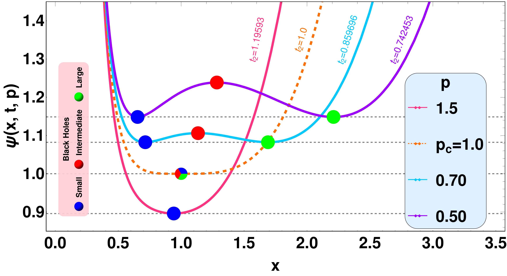

---

##### Download

+ [Paper](paper2.pdf)

---

##### Abstract

We study the relationship between the standard or extended thermodynamic phase structure of various anti–de Sitter black holes and the Lyapunov exponents associated with the null and timelike geodesics. We consider dyonic, Bardeen, Gauss-Bonnet, and Lorentz-symmetry breaking massive gravity black holes and calculate the Lyapunov exponents of massless and massive particles in unstable circular geodesics close to the black hole. We find that the thermal profile of the Lyapunov exponents exhibits distinct behavior in the small and large black hole phases and can encompass certain aspects of the van der Waals type small/large black hole phase transition. We further analyze the properties of Lyapunov exponents as an order parameter and find that its critical exponent is 1/2, near the critical point for all black holes considered here.
---

##### Figure 2: Dimensions of a sausage dog



---

##### Citation

Bhaskar Shukla, Pranaya Pratik Das, David Dudal and Subhash Mahapatra. 2024. "Interplay between the Lyapunov exponents and phase transitions of charged AdS black holes." *Phys. Rev. D* 110 (2) p.024068. https://link.aps.org/doi/10.1103/PhysRevD.110.024068.

```BibTeX
@article{PhysRevD.110.024068,
  title = {Interplay between the Lyapunov exponents and phase transitions of charged AdS black holes},
  author = {Shukla, Bhaskar and Das, Pranaya Pratik and Dudal, David and Mahapatra, Subhash},
  journal = {Phys. Rev. D},
  volume = {110},
  issue = {2},
  pages = {024068},
  numpages = {32},
  year = {2024},
  month = {Jul},
  publisher = {American Physical Society},
  doi = {10.1103/PhysRevD.110.024068},
  url = {https://link.aps.org/doi/10.1103/PhysRevD.110.024068}}
```

---

