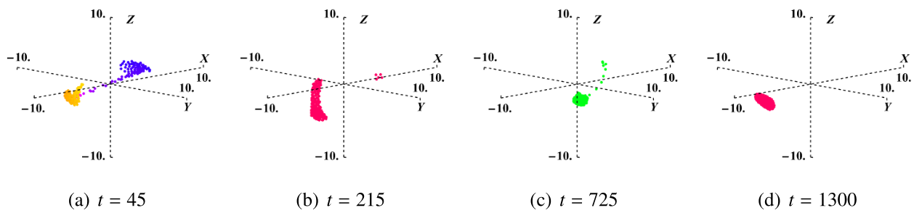

---

##### Abstract

In this study, we demonstrate that cyclically symmetric Thomas oscillators can serve as swarmalators— agents exhibiting both swarming and phase synchronization— when coupled with Kuramoto-type phase dynamics. The resulting model represents a nonlinear particle aggregation system, characterised by cyclic spatial symmetry and position-dependent phase evolution. This coupling gives rise to rich spatio-temporal phenomena, including pre-hexatic or hexatic $2D$ structures, as well as chaotic turbulence under extreme parameter regimes. These emergent patterns result from nonlinear self-organization, manifesting as a form of active turbulence. Our analysis reveals that the nature and strength of inter-particle interactions, controlled by key system parameters, dictate the organization and dynamical behavior of the swarm. As a representative active, non-equilibrium system, this framework provides insights into the fundamental mechanisms of collective motion and offers applications in the design of synthetic active materials and coordinated microscale systems.---

##### Figure 4: Swarming in 3D space for b=0.1 in the Thomas oscillator at randomly selected time points.



---

##### Download

+ [Paper](paper4.pdf)

---

##### Citation

Vinesh Vijayan and Pranaya Pratik Das. 2022. "Cyclically Symmetric Thomas Oscillators As Swarmalators: A paradigm for Active Fluids \& Pattern Formation." ** arXiv preprint arXiv:2211.00336 (2022)..

```BibTeX
@article{VIJAYAN2025109216,
title = {Cyclically symmetric Thomas oscillators as swarmalators: a model for active fluids and pattern formation},
journal = {Communications in Nonlinear Science and Numerical Simulation},
pages = {109216},
year = {2025},
issn = {1007-5704},
doi = {https://doi.org/10.1016/j.cnsns.2025.109216},
url = {https://www.sciencedirect.com/science/article/pii/S1007570425006276},
author = {Vinesh Vijayan and Pranaya Pratik Das and K. Hariprasad and P. Sathish Kumar},
keywords = {Swarming, Collective motion, Pattern formation, Hexatic order, Turbulent motion},
abstract = {In this study, we demonstrate that cyclically symmetric Thomas oscillators can serve as swarmalators—agents exhibiting both swarming and phase synchronization—when coupled with Kuramoto-type phase dynamics. The resulting model represents a nonlinear particle aggregation system, characterised by cyclic spatial symmetry and position-dependent phase evolution. This coupling gives rise to rich spatio-temporal phenomena, including pre-hexatic or hexatic 2D structures, as well as chaotic turbulence under extreme parameter regimes. These emergent patterns result from nonlinear self-organization, manifesting as a form of active turbulence. Our analysis reveals that the nature and strength of inter-particle interactions, controlled by key system parameters, dictate the organization and dynamical behavior of the swarm. As a representative active, non-equilibrium system, this framework provides insights into the fundamental mechanisms of collective motion and offers applications in the design of synthetic active materials and coordinated microscale systems.}
}```

---