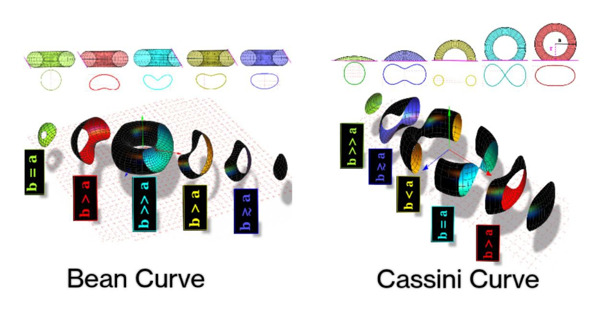

---

##### Download

+ [Paper](paper5.pdf)

---

##### Abstract

The boundary of a billiard system plays a crucial role in shaping its dynamics, which may be integrable, mixed, or fully chaotic. When a boundary has varying curvature, it offers a unique setting to study the relation between classical chaos and quantum behaviour. In this study, we introduce two geometrically distinct billiards: a bean-shaped boundary and a peanut-shaped variant of Cassini ovals. These systems incorporate both focusing and defocusing walls with no neutral segments. Our study reveals a strong correlation between classical and quantum dynamics. Our analysis of billiard flow diagrams confirms sensitivity to initial conditions(ICs)—a defining feature of chaos. Poincar´e maps further show the phase space intricately woven with regions of chaotic motion and stability islands. Moving to the quantum domain, we employ nearest-neighbour spacing distribution and level spacing ratio as statistical measures to characterise chaos. Early time saturation in spectral complexity also supports an ergodic hierarchy in these systems. We observe a striking quantum phenomenon, i.e. eigenfunction scarring. This work bridges geometric boundary effects, classical hyperbolicity, and quantum ergodicity, offering a framework to engineer chaos in confined systems.
---
##### Figure 5: Bean and Cassini curves as Toric sections.



---


##### Citation

Pranaya Pratik Das, Tanmayee Patra, and Biplab Ganguli. 2025. "Manifestations of chaos in billiards: the role of mixed curvature." ** arXiv preprint arXiv:2501.08839 (2025)..

```BibTeX
@article{das2025manifestations,
  title={Manifestations of chaos in billiards: the role of mixed curvature},
  author={Das, Pranaya Pratik and Patra, Tanmayee and Ganguli, Biplab},
  journal={arXiv preprint arXiv:2501.08839},
  year={2025}}
```

---